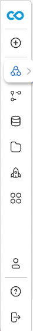

## A new way to do computational research

Code Ocean provides a new way to do computational research that is Reproducible, Collaborative, and quick to deploy. The Code Ocean platform relies on tools you may be familiar with, all integrated into a single platform. 

[Introduction to Code Ocean slides]()

### Orientation to the platform

1. Log onto Code Ocean
2. You are brought to your My Capsule Dashboard. You can use the side navigation bar to go to other Code Ocean dashboards or return to the Capsule dashboard at any time.  

In Code Ocean, the unit used to create, organize, and share research projects is a Capsule. The Capsule contains the code, environment, data, and results of a run. Once in a Capsule, there are 3 panes: the File Navigation/App Builder Panel, the Editor Panal, and the Reproducibility Panel. 

1. File Navigation and App Builder (Left)
- The file tree contains Metadata, Environment, Code, Data, Scratch, and Results folders.
- The App Builder allows you create an App Panel to interact with Capsules without modifying the code by passing arguments to the command line.
2. Editor (Center)
- Edit Capsule files, including setting up the environment and modifying metadata.
- View data and result files.
3. Reproducibility (Right)
- Perform a Reproducible Run.
- Launch a Cloud Workstation.
- Manage changes to files via Git.
- View results of previous runs and the history of the Capsule in the Timeline.

