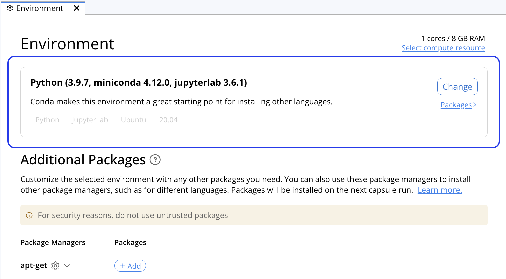
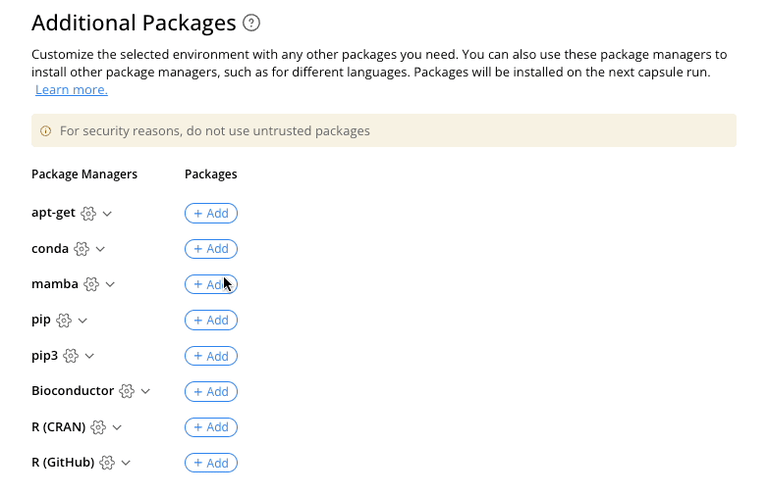

# Create a reproducible analysis in the Cloud in 5 minutes

## Create a new Capsule
There are multiple ways to create a new Capsule: 
Now we will Click __+ New Capsule__ in the top right corner, then __Create New__.

## Configuring the environment
Configure the environment by selecting the starter environment from the list of options, which is analogous to the type of machine to run.  The Python and R environment is a good choice for coding in these languages, or using Jupyter Notebook/Lab or RStudio.

The environment can be customized in several ways.  For now, we will start by installing a package, matplotlib, with pip. A version number can be specified. By default the latest version is used.

## Code development 

## Attaching data 

## The Reproducible Run 