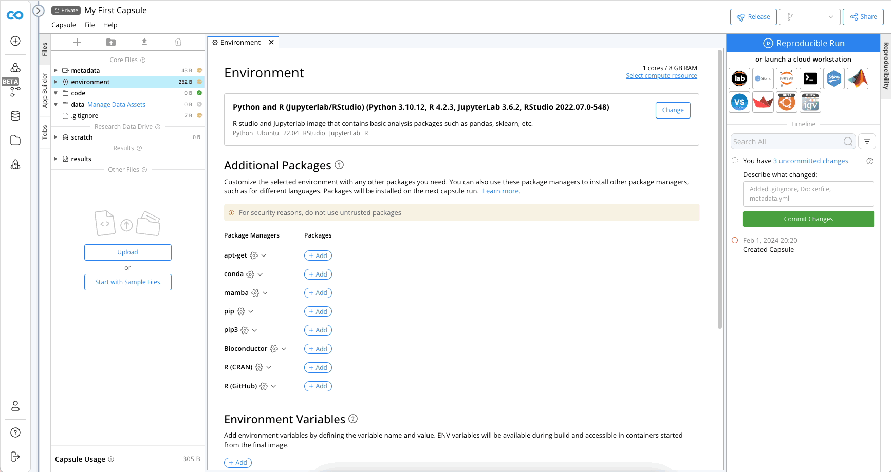
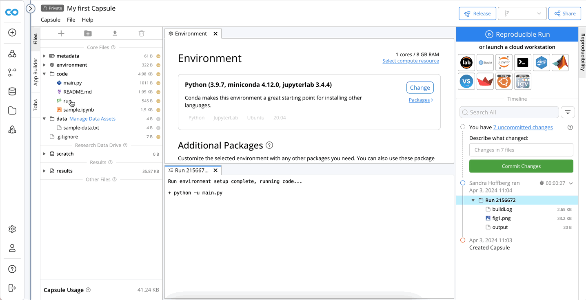

# Create a reproducible analysis in the Cloud in 5 minutes

## Create a new Capsule
There are multiple ways to create a new Capsule: 
We will Click __+ New Capsule__ in the top right corner, then __Create New__.

## Configuring the environment
Configure the environment by selecting the starter environment from the list of options, which is analogous to the type of machine to run.  We will use the Python  environment shown below.

The environment can be customized in several ways.  For now, we will install a package, matplotlib. A version number can be specified. By default the latest version is used.

## Code development 
To add sample code using the existing template, go to the left panel below results. Click Start with Sample Files. Files will appear in the folders above.

We will use sample code for this example, but you can easily add folders and files to Capsules in Code Ocean by dragging and dropping or right clicking in the File Navigation Panel. 
No Data Assets are required to run this code, but data can easily be added by clicking __Manage Data Assets__ next to the `/data` folder. 

## The Reproducible Run 
Click Reproducible Run to see the results generated from sample files. A Reproducible Run executes the run file, which is a bash driver script. When executing a Reproducible Run, the run file will be the only file executed, and it will be executed end to end. Therefore, the driver script enables all desired results to be generated in an automated way without any human intervention.

The results from each Reproducible Run can be accessed from the Capsule Timeline. The results folder contains the output from the most recent Reproducible Run. After a successful Reproducible Run, it is good practice to commit changes to ensure a fully functional version of the Capsule is documented in the Timeline.

