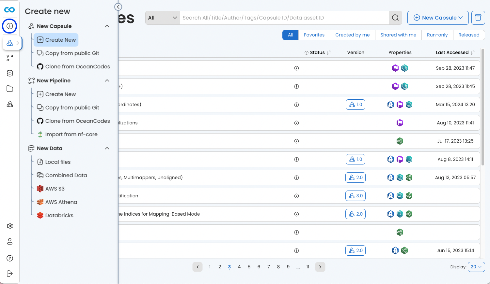

# Create a reproducible analysis in the Cloud in 5 minutes

## Create a new Capsule
There are multiple ways to create a new Capsule: 
Click ‘+ New Capsule’ in the top right corner, then Create New.

## Configuring the environment
Configure the environment by selecting the starter environment from the list of options, which is analogous to the type of machine to run.  The Python and R environment is a good choice for coding in these languages, or using Jupyter Notebook/Lab or RStudio.

Code development  
Attaching data  
The Reproducible Run  
