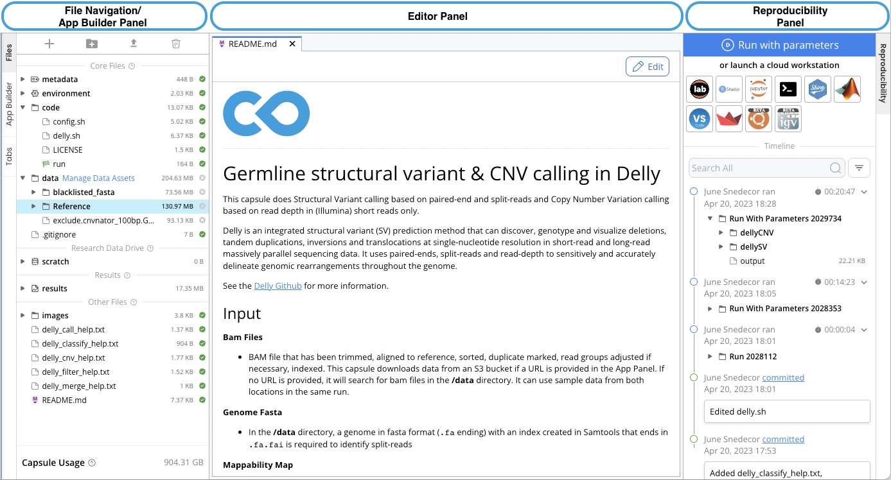

## A new way to do computational research

Code Ocean provides a new way to do computational research that relies on tools you may be familiar with, all integrated into a single platform. 

[Introduction to Code Ocean slides]()

### Orientation to the platform

1. Log onto Code Ocean
2. You are brought to your My Capsule Dashboard. You can use the side navigation bar to go to other Code Ocean dashboards or return to the Capsule dashboard at any time.  

Once in a Capsule, there are 3 panes: the File Navigation/App Builder Panel, the Editor Panal, and the Reproducibility Panel. 

